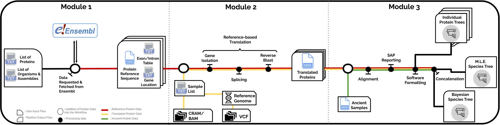

# Summary

Ancient proteins from fossilized or semi-fossilized remains can yield
phylogenetic information at broad temporal horizons, in some cases even
millions of years into the past. In recent years, peptides extracted
from archaic hominins and long-extinct mega-fauna have enabled
unprecedented insights into their evolutionary history. In contrast to
the field of ancient DNA - where several computational methods exist to
process and analyze sequencing data - few tools exist for handling
ancient protein sequence data. Instead, most studies rely on loosely
combined custom scripts, which makes it difficult to reproduce results
or share methodologies across research groups. Here, we present
PaleoProPhyler: a new fully reproducible pipeline for aligning ancient
peptide data and subsequently performing phylogenetic analyses. The
pipeline can not only process various forms of proteomic data, but also
easily harness genetic data in different formats (CRAM, BAM, VCF) and
translate it, allowing the user to create reference panels for
phyloproteomic analyses. We describe the various steps of the pipeline
and its many functionalities, and provide some examples of how to use
it. PaleoProPhyler allows researchers with little bioinformatics
experience to efficiently analyze palaeoproteomic sequences, so as to
derive insights from this valuable source of evolutionary data.

#### 

PaleoProPhyler is released under a CC-BY license and available from
[Github](https://github.com/johnpatramanis/Proteomic_Pipeline)

# Statement of Need

Recent advances in protein extraction and mass spectrometry
[@ruther2022spin; @lanigan2020multi; @porto2011new] have made it
possible to isolate ancient peptides from organisms that lived thousands
or even millions of years ago. Certain ancient proteins have a lower
degradation rate and can be preserved for longer than ancient DNA
[@cappellini2014unlocking; @demarchi2016protein; @hendy2021ancient; @warinner2022_paleoproteomics].
The sequences of these proteins contain evolutionary information and
thus have the potential to resolve important scientific questions about
the deep past, which are not approachable via other methods. Tooth
enamel proteins in particular have been successfully extracted from
multiple extinct species, in order to resolve their relationships to
other species
[@welker2017middle; @cappellini2019early; @welker2019enamel; @welker2020dental; @buckley2015ancient; @buckley2019collagen].

#### 

Ancient proteomic studies typically use combinations of custom scripts
and repurposed software, which require extensive in-house knowledge and
phylogenetic expertise, and are not easily reproducible. Barriers to
newcomers in the field include difficulties in properly aligning the
fractured peptides with present-day sequences, translating available
genomic data for comparison, and porting proteomic data into standard
phylogenetic packages. The creation of automated pipelines like PALEOMIX
[@schubert2014characterization] and EAGER [@peltzer2016eager] have
facilitated the streamlining and reproducibility of ancient DNA
analyses, which has been particularly helpful for emerging research
groups around the world. This has undoubtedly contributed to the growth
of the field [@lan2018technical]. Yet, the field of palaeoproteomics
still lacks a "democratizing" tool that is approachable to researchers
of different backgrounds and expertises.

#### 

Another important issue in phyloproteomics is the relative scarcity of
proteomic datasets [@muller2020proteome; @brandt2022palaeoproteomics].
There are currently tens of thousands of publicly available whole genome
sequences, covering hundreds of species
[@lewin2018earth; @byrskahigh; @prado2013great; @zhang2014comparative; @koepfli2015genome].
The amount of publicly available proteome sequences is much smaller in
comparison. For most vertebrate species, lab-generated protein data does
not even exist and phyloproteomic research is reliant on sequences
translated *in silico* from genomic data. These, more often than not,
are not sufficiently validated or curated [@bagheri2020detecting]. As a
result, assembling a proper reference dataset for phyloproteomics can be
challenging. Given how important rigorous taxon sampling is in
performing proper phylogenetic reconstruction
[@rosenberg2003taxon; @heath2008taxon], having a complete and reliable
reference dataset is crucial. In the case of proteins, the typically
short sequence length and the low amounts of sequence diversity - due to
the strong influence of purifying selection - means that absence of
knowledge about even a single amino acid polymorphism (SAP) can strongly
affect downstream inferences
[@opperdoes2003phylogenetic; @presslee2019data; @demarchi2022ancient; @chen2019late].

#### 

To address all of the above issues, we present "PaleoProPhyler": a fully
reproducible and easily deployable pipeline for assisting researchers in
phyloproteomic analyses of ancient peptides. "PaleoProPhyler" is based
on the workflows developed in earlier ancient protein studies
[@cappellini2019early; @welker2019enamel; @welker2020dental], with some
additional functionalities. It allows for the search and access of
available reference proteomes, bulk translation of CRAM, BAM or VCF
files into amino acid seuqences in FASTA format, and various forms of
phylogenetic tree reconstruction. Below we provide a description of the
pipeline, including its most important features and functionalities.

::: figure*

:::

# Description of the Pipeline

To maximize reproducibility, accessibility and scalability, we have
built our pipeline using Snakemake [@molder2021sustainable] and Conda
[@anaconda]. The Snakemake format provides the workflow with tools for
automation and computational optimization, while Conda enables the
pipeline to operate on different platforms, granting it ease of access
and portability. The pipeline is divided into three distinct but
interacting modules, each of which is composed of a Snakemake script and
a Conda environment. The modules are intended to synergize with each
other, but can also be used independently.

#### 

**Module 1** is designed to provide the user with a baseline (curated)
reference dataset as well as the resources required to perform the *in
silico* translation of proteins from mapped whole genomes. The input of
this module is a user-provided list of proteins and a list of organisms.
Both input lists should be in a simple \*.TXT file. The user also has
the option of choosing a particular reference build. Utilizing the
Ensembl API [@yates2015ensembl], the module will return 3 different
resources for each requested protein and for each requested organism /
reference build. The 3 output resources are:

1.  The reference protein sequence in FASTA format [@lipman1985rapid].

2.  The location (position and strand) of the gene that corresponds to
    the protein.

3.  The start and end of each exon and intron of that gene/isoform.

The downloaded FASTA sequences are available individually but can also
be assembled into species- and protein-specific datasets. They can be
immediately used as a reference dataset for either downstream
phylogenetic analyses or as an input database for mass spectrometry
software, like MaxQuant [@cox2008maxquant], Pfind [@chi2018open], PEAKS
[@ma2003peaks] and others
[@demichev2018dia; @kong2017msfragger; @solntsev2018enhanced; @perkins1999probability].
The gene location information and the exon/intron tables can be utilized
automatically by Module 2. For the requested proteins, the module will
select the Ensembl canonical isoform by default. Should the user desire
a specific isoform or all protein coding isoforms of a protein, they
have the ability to specify that as an option in the protein list \*.TXT
file.

#### 

**Module 2** is designed to utilize the resources generated by Module 1
and to extract, splice and translate genes from whole genome data, into
the proteins of interest. Module 2 can handle some of the most commonly
used genomic data file formats, including the BAM [@li2009sequence],
CRAM [@bonfield2022cram] and VCF [@danecek2011variant] formats. The
easiest way to run Module 2 is to first run Module 1 for a set of
proteins and a selected organism. This will generate all the necessary
files and resources required for protein translation. The selected
organism will be used as a reference for the translation process. All
genomic data to be translated must be mapped onto the same reference
organism. The user can then run Module 2 simply by providing the
organism's name (and reference version), as well as a list of the
samples to be translated, both in a \*.TXT file. Should the user want to
translate samples from a VCF file, they will also need to provide a
reference genome in FASTA format, to complement the variation
information of the VCF file. After executing the module, an initial
'normalization' step is performed, where all input files are formatted
and indexed. Once this is complete, the locations of the genes are used
to extract their sequence and the exon/intron information is used to
splice them. These isolated and spliced genomic sequences are then
BLASTed [@{camacho2009blast+}] onto the reference protein sequence, and
the matching translated amino acids are stitched together into the final
translated protein sequences. In the last step, the translated sequences
are organized into 3 alternative databases:

1.  The 'Per protein' database: a folder containing one FASTA file for
    each translated protein. Each protein FASTA file contains the
    sequences of that protein for all samples

2.  The 'Per individual' database: a folder containing one FASTA file
    for each translated sample / individual. Each sample FASTA file
    contains all of the translated proteins for that sample.

3.  The 'All Protein Reference' database: a single FASTA file containing
    all translated proteins for all samples.

Any of these FASTA files can be instantly merged with an ancient protein
dataset and used in Module 3.

#### 

**Module 3** is designed to perform a phylogenetic analysis, with some
modifications specifically designed for palaeoproteomic data. The input
of the Module is a FASTA file, containing all of the protein sequences
from both the reference dataset and the ancient sample(s) to be
analyzed. Accompanying this FASTA file should be a \*.TXT file that
contains the name of the dataset-FASTA file as well as the names of all
of the ancient samples included in that dataset. The dataset will
automatically be split into protein specific sub-datasets, each of which
will be aligned and checked for SAPs.

The alignment is a two step process which includes first isolating and
aligning the modern/reference dataset and then aligning the ancient
samples onto the modern ones using Mafft [@katoh2013mafft]. Isobaric
amino acids that cannot be distinguished from each other by the Mass
Spectrometer are corrected to ensure the downstream phylogenetic
analysis can proceed without problems. Specifically, any time an
Isoleucine (L) or a Leucine (L) is identified in the alignment, all of
the modern sequences are checked for that position. If all of them share
one of the 2 amino acids, then the ancient samples are also switched to
that amino acid. If both I and L appear on some present-day samples,
both present-day and ancient samples are switched to an L. The user also
has the option to provide an additional \*.TXT file named 'MASKED'.
Using this optional file, the user can 'mask' a present-day sample such
that it has the same missing sub-sequences as an ancient sample.

Finally a small report is generated for each ancient sample in the
dataset, and a maximum likelihood phylogenetic tree is generated for
each protein sub-dataset through PhyML [@guindon2010new]. All protein
sub-dataset alignments are then also merged together into a concatenated
dataset. The concatenated dataset is used to generate a
maximum-likelihood species tree [@felsenstein1981evolutionary] through
PhyML and a Bayesian species tree
[@rannala1996probability; @mau1997phylogenetic] through MrBayes
[@huelsenbeck2001mrbayes]. The tree generation is parallelized using
Mpirun [@mpi40].

#### 

A more in-depth explanation of each step of each module, as well as the
code being run in the background, is provided on the software's Github
page.

# Application

As proof of principle, we deploy this pipeline in the reconstruction of
ancient hominid history using the publicly available enamel proteomes of
*Homo antecessor* and *Gigantopithecus blacki*, in combination with
translated genomes from hundreds of present-day and ancient hominid
samples. In the process, we have generated the most complete and up to
date, molecular hominid phyloproteomic tree
[1](#fig:PhyloTree){reference-type="ref" reference="fig:PhyloTree"}. The
process of generating the reference dataset and its phyloproteomic tree
using PaleoProPhyler is covered in detail in the step-by-step Github
Tutorial. The dataset used as input for the creation of the phylogenetic
tree is available at Zenodo Link (REF)

{#fig:PhyloTree
width="45%"}

# Protein Reference Dataset

In order to facilitate future analyses of ancient protein data, we also
generated a publicly-available palaeoproteomic hominid reference
dataset, using Modules 1 and 2. We translated 204 publicly available
whole genomes from all 4 extant Hominid genera
[@byrskahigh; @prado2013great; @nater2017morphometric]. Details on the
preparation of the translated samples can be found in the supplementary
materials. We also translated multiple ancient genomes from VCF files,
including those of several Neanderthals and one Denisovan
[@prufer2017high; @mafessoni2020high]. Since the dataset is tailored for
palaeoproteomic tree sequence reconstruction, we chose to translate
proteins that have previously been reported as present in either teeth
or bone tissue. We compiled a list of 1696 proteins from previous
studies
[@castiblanco2015identification; @alves2011unraveling; @acil2005detection; @salmon2016global; @jagr2012comprehensive; @park2009proteomics]
and successfully translated 1,543 of them. For each protein, we
translated the canonical isoform as well as all alternative isoforms,
leading to a total of 10,058 protein sequences for each individual in
the dataset. Details on the creation of the protein list can be found in
the supplementary materials. The palaeoproteomic hominid reference
dataset is publicly available at Zenodo link (REF)

# Availability and Community Guidelines

PaleoProPhyler is publicly available on
[github](https://github.com/johnpatramanis/Proteomic_Pipeline): The
software requires the prior installation of Conda. The github repository
contains a tutorial for using the workflow presented here, with the
proteins recovered from the *Homo antecessor* and *Gigantopithecus
blacki* as examples. We welcome code contributions, feature requests,
and bug reports via Github. The software is released under a CC-BY
license.

#### 

# Author Contributions

-   **Ioannis Patamanis**: Conceptualization, manuscript writing, code
    writing for the Snakemake scripts, compilation of the Conda
    environments and application of the pipelines to produce the results
    described in the 'Application' and 'Protein Reference Dataset'
    section.

-   **Jazmin Ramos Madrigal**: Manuscript review, conceptualization and
    code for multiple R and bash scripts utilised by the Snakemake
    script as steps of the pipeline.

-   **Enrico Cappellini** : Manuscript review and editing

-   **Fernando Racimo** : Conceptualization, manuscript writing, review
    and editing

#### 

# Acknowledgements

We thank Ryan Sinclair Paterson, Graham Gower, Alberto Taurozzi, Martin
Petr, Evan Irving-Pease and members of the Racimo and Cappellini groups,
who provided valuable help and feedback throughout the project.

#### 

# Funding

The project was funded by the European Union's EU Framework Programme
for Research and Innovation Horizon 2020, under Grant Agreement No.
861389 - PUSHH. FR was additionally supported by a Villum Young
Investigator Grant (project no. 00025300), a COREX ERC Synergy grant (ID
951385) and a Novo Nordisk Fonden Data Science Ascending Investigator
Award (NNF22OC0076816). E.C. has received funding from the European
Research Council (ERC) through the ERC Advanced Grant \"BACKWARD\",
under the European Union's Horizon 2020 research and innovation program
(grant agreement No. 101021361).
